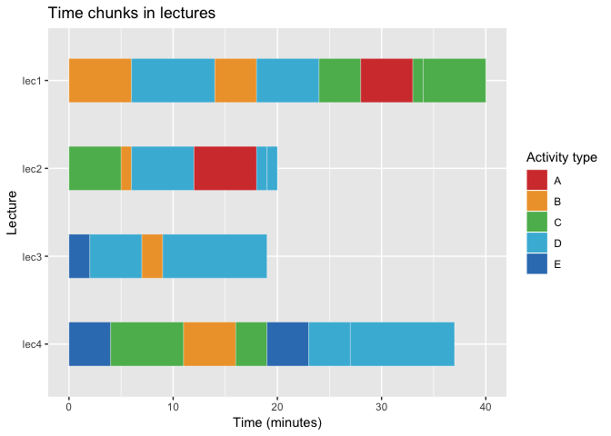

Plotting time chunks
================
Ian Handel
2019-04-08

``` r
library(ggplot2) # for plotting
library(dplyr) # to wrangle data
```

    ## Warning: package 'dplyr' was built under R version 3.5.2

    ## 
    ## Attaching package: 'dplyr'

    ## The following objects are masked from 'package:stats':
    ## 
    ##     filter, lag

    ## The following objects are masked from 'package:base':
    ## 
    ##     intersect, setdiff, setequal, union

``` r
library(forcats) # to change factor levels
library(ggsci) # for palette
```

Make some data with... column for lecture, column for time spent column for class of activity

``` r
dat <- tibble(lecture = rep(paste0("lec", 1:4), c(8, 6, 4, 7)),
                  time = sample(1:10, 25, replace = TRUE),
                  type = sample(LETTERS[1:5], 25, replace = TRUE))

dat
```

    ## # A tibble: 25 x 3
    ##    lecture  time type 
    ##    <chr>   <int> <chr>
    ##  1 lec1        4 E    
    ##  2 lec1       10 A    
    ##  3 lec1        8 D    
    ##  4 lec1        6 D    
    ##  5 lec1        6 B    
    ##  6 lec1        6 E    
    ##  7 lec1        3 A    
    ##  8 lec1        4 B    
    ##  9 lec2        8 D    
    ## 10 lec2        2 C    
    ## # … with 15 more rows

Then add a column, for each lecture with the cumulative time spent (need this to give unique ID for each chunk)

``` r
dat <- dat %>%
  group_by(lecture) %>% 
  mutate(time_cumul = cumsum(time))

dat
```

    ## # A tibble: 25 x 4
    ## # Groups:   lecture [4]
    ##    lecture  time type  time_cumul
    ##    <chr>   <int> <chr>      <int>
    ##  1 lec1        4 E              4
    ##  2 lec1       10 A             14
    ##  3 lec1        8 D             22
    ##  4 lec1        6 D             28
    ##  5 lec1        6 B             34
    ##  6 lec1        6 E             40
    ##  7 lec1        3 A             43
    ##  8 lec1        4 B             47
    ##  9 lec2        8 D              8
    ## 10 lec2        2 C             10
    ## # … with 15 more rows

Then plot Each lecture maps to an x column Time slots 'stack' and have fill colour of 'type' Tidy up axis lables with labs()

``` r
ggplot(dat) +
  aes(x = fct_rev(lecture), y = time, fill = type, group = time_cumul) +
  geom_bar(stat = "identity", position = position_stack()) +
  labs(title = "Time chunks in lectures",
       x = "Lecture",
       y = "Time (minutes)",
       fill = "Activity type")
```


Looks nicer if flipped around... coord\_flip() could just be added onto code above or this way takes last plot and adds it...

``` r
last_plot() +
  coord_flip()
```


Maybe nicer with different colours

``` r
last_plot() +
  ggsci::scale_fill_locuszoom()
```


